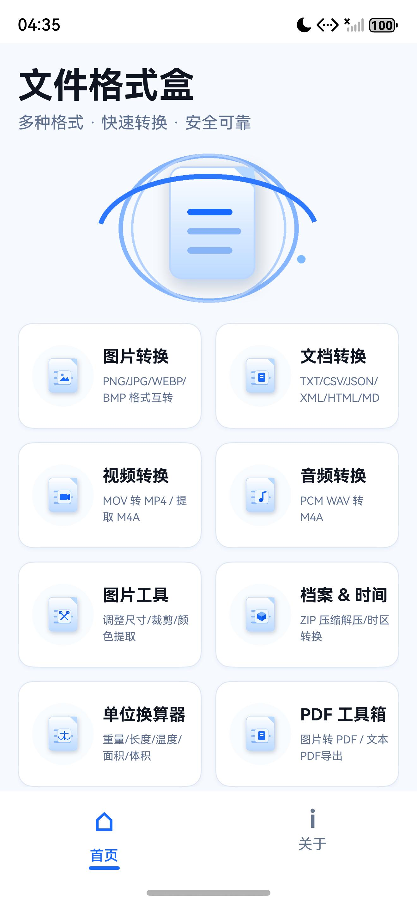
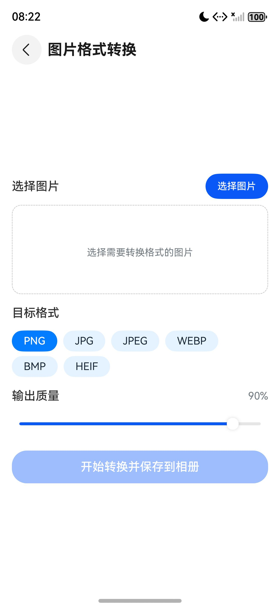
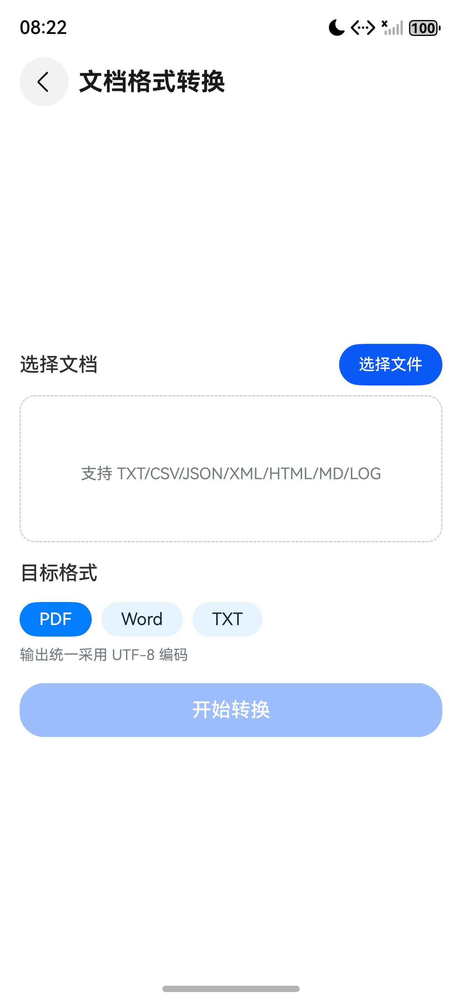
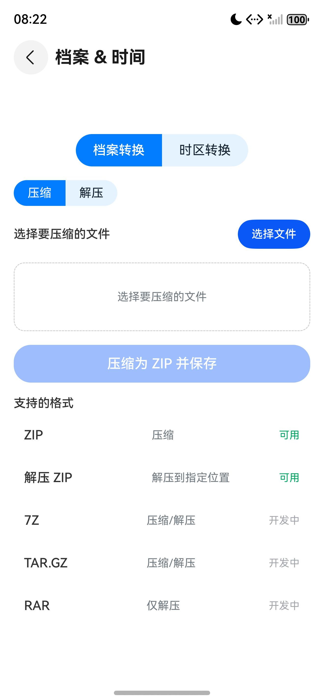

# 文件格式盒（FormatConverter）

HarmonyOS 原生本地文件格式转换工具：文档、图片、视频、ZIP 与受限 PDF 转换，外加图片工具、时区与单位换算，共七个功能入口，全部在设备端完成；不申请任何权限、无后端、不上传文件，飞行模式与无网环境下可正常使用。

> 设计基线与能力矩阵见 [docs/开发文档.md](docs/开发文档.md)，验收与交互证据见 [docs/qa/](docs/qa/README.md)。

## 技术栈

- HarmonyOS API 22（系统 6.0.2），ArkTS 5.0 + ArkUI 声明式范式，Stage 模型（UIAbility）
- 设备类型：phone、tablet、2in1；按 320vp / 600vp / 840vp 断点切换 2 / 3 / 4 列布局，独立工具页固定 `NavigationMode.Stack`
- 系统能力：ImageKit（图片解码与调整）、MediaKit（AVTranscoder 视频转码）、CoreFileKit（系统文件选择器与保存）、MediaLibraryKit（保存到相册），无网络依赖
- Native 扩展：C++17 + CMake 构建 `libnative_audio.so`，提供 MP4 内 AAC 音轨提取与 MOV 无损重封装能力（AudioCodec / AVMuxer / AVSource / AVDemuxer）
- 架构要点：`engines/` 转换引擎抽象层（`IConvertEngine` + `EngineRegistry` + `NativeTextEngine`）隔离原生 Kit 与后续离线引擎；`common/converters/` 承载文档转换矩阵
- 无第三方运行时依赖，仅本地 OHPM 依赖（测试用 `@ohos/hypium`）；无用户文件持久化需求，中间产物写入应用沙箱后清理
- 用户可见文本最小字号 10fp，共享组件 `PrivacyNoticeSection` 在首页与关于页复用
- 构建工具：Hvigor（`assembleHap`）

## 功能特性

**图片格式转换**

- PNG、JPG、JPEG、WEBP、BMP 互转，输出质量 10% ~ 100% 可调（默认 90%）
- 一次最多选择 9 张图片批量转换，转换完成后经系统授权保存到相册
- 目标格式列表只保留上述五种，其他格式不会出现在页面上；系统文件选择器仍允许选入 HEIF / HEIC 图片，这类文件会得到「暂不支持离线转换」提示

**文档格式转换**

- 源格式 TXT、LOG、CSV、JSON、XML、HTML、MD，一次最多选择 9 个文件批量转换
- 源文件编码可选 UTF-8 / GBK / UTF-16LE，输出统一 UTF-8
- 目标格式：PDF 与 Word（DOC）常驻，JSON、XML、MD、HTML、CSV 按全部已选源文件的共同可转换关系动态过滤
- 转换矩阵：TXT / LOG → MD、HTML；CSV → JSON、XML、MD、HTML；JSON → CSV、XML、MD、HTML；XML → JSON、CSV、MD、HTML；MD → HTML；HTML → MD
- 批量结果先写入应用沙箱暂存，再由一次系统保存对话框选择全部输出位置，保存结束或失败后清理暂存文件
- 转换过程中展示进度条与每个文件的结果状态

**视频转换**

- 输入 MP4、MOV、AVI、MKV、FLV、WMV、3GP，一次最多选择 5 个文件
- 目标格式仅 MP4 与 M4A（提取音频）两项
- MOV 输入走无损重封装：按时间戳交错复制 H.264 视频与 AAC 音频样本，不启动编码器
- 其余输入走 AVTranscoder 转码为 MP4（H.264 + AAC，2 Mbps / 128 kbps）；设备或格式不支持时给出明确失败提示
- M4A 提取仅在全部输入都是 MP4 时可用，否则按钮禁用并提示；提取由 Native 能力完成，不重新编码音轨

**图片工具**

- 图像调整：指定宽 / 高，可保持宽高比
- 裁剪图片：指定 X / Y 起点与裁剪宽高
- 颜色提取：从图片中央区域采样，输出主色调
- 三项操作基于 ImageKit PixelMap 离线完成，结果保存到相册

**档案与时间**

- 档案转换：ZIP 压缩（一次最多 20 个文件）与 ZIP 解压，选择器覆盖 31 类常用后缀
- 时区转换：UTC、CST（北京时间）、EST（美东）、PST（美西）、JST（日本）、GMT（格林威治）、CET（中欧）、IST（印度）、KST（韩国）、AEST（澳东）十个时区互转
- 跨日结果标注 +1 天 / -1 天，非法分钟输入给出提示

**单位换算器**

- 重量：千克、克、毫克、磅、盎司、吨、斤
- 长度：米、千米、厘米、毫米、英尺、英寸、英里、码
- 面积：平方米、平方千米、公顷、英亩、平方英尺、亩
- 体积：升、毫升、加仑、夸脱、杯
- 温度、速度、时间、数据存储：单位表见 `pages/UnitConverterPage.ets`
- 输入即时联动换算，切换分类或单位后按当前数值重算

**PDF 工具箱**

- 图片转 PDF：JPG / PNG / WEBP / BMP 合成 PDF，一次最多 9 张，单文件上限 10 MB
- 文本转 PDF：TXT / MD 转为 PDF；HTML 转 PDF：提取 HTML 文本后生成
- 反向转换：项目自产未压缩文本 PDF 转 Word（DOC）或 Markdown，单文件上限 20 MB
- 超出体积上限、加密 PDF、对象流 PDF 与非自产 PDF 均给出明确提示，不进入转换

## 截图

> 以下为 `docs/qa/` 中已入库的设备运行截图（2026-08-03 版界面）。此后发布版本按 AppGallery 审核反馈下架了未验证能力，因此截图中的音频转换入口、HEIF 目标格式与 7Z/TAR.GZ/RAR 占位均不再出现在当前代码中。

| 说明 | 截图 |
| --- | --- |
| 首页：七个功能入口、品牌标题与底栏（截图仍含已下架的音频转换卡片） |  |
| 图片格式转换：目标格式、输出质量与保存到相册（截图仍含已下架的 HEIF 目标） |  |
| 文档格式转换：目标格式按源文件动态过滤（截图早于编码选项增加，当前支持 UTF-8 / GBK / UTF-16LE） |  |
| 档案与时间：ZIP 压缩 / 解压（截图内的 7Z、TAR.GZ、RAR 与「开发中」占位已下架，当前仅保留 ZIP） |  |

## 目录结构

```text
AppScope/                     应用级配置（bundleName、版本、图标）
entry/src/main/
  cpp/                        Native 音视频能力（CMakeLists.txt、native_audio.cpp、libnative_audio 类型声明）
  ets/entryability/           UIAbility 入口
  ets/pages/                  Index、DocumentConvertPage、ImageConvertPage、VideoConvertPage、
                              ImageToolsPage、ArchiveTimePage、UnitConverterPage、PdfToolsPage、AboutPage
  ets/components/             页头、文件选择面板、格式选择器、进度条、结果列表、
                              隐私说明区块（PrivacyNoticeSection）等共享组件
  ets/engines/                转换引擎抽象层（IConvertEngine、EngineRegistry、NativeTextEngine）
  ets/services/               文档与图片转换、视频音轨提取、视频重封装、文件选择与保存服务
  ets/common/                 常量、模型、工具与 converters/ 文档转换核心
  resources/                  字符串、颜色、媒体资源与路由配置（base/profile/main_pages.json）
docs/                         开发文档、QA 证据、功能方案与设计规格
scripts/                      构建脚本、静态门禁与 Node 契约测试
design.md / design-qa.md      产品设计与 QA 状态
AGENTS.md                     开发代理规则
build-profile.json5           工程构建配置（6.0.2(22)）
oh-package.json5              工程依赖
```

## 构建与运行

1. 安装 DevEco Studio（需支持 API 22 的 SDK 6.0.2），并在 SDK Manager 中安装 HarmonyOS 6.0.2(22) SDK
2. 用 DevEco Studio 打开仓库根目录，等待 SDK 与 Hvigor 依赖同步完成
3. 在 DevEco Studio 中为本机配置自动签名（本地运行），或写入自己的签名材料
4. 选择 `entry` 模块与目标设备（phone / tablet / 2in1）直接运行，或用脚本构建与检查：

```powershell
# 静态门禁：标准文档、Stage 配置、目录职责与能力契约
powershell -NoProfile -ExecutionPolicy Bypass -File .\scripts\check-standard.ps1

# 构建（脚本优先使用工程内 hvigorw，否则回退 DevEco Studio 自带的 Hvigor）
powershell -NoProfile -ExecutionPolicy Bypass -File .\scripts\build-harmony.ps1

# ArkTS 类型检查与全部 Node 契约测试
node .\scripts\_type_check.js
Get-ChildItem .\scripts\test-*.js | ForEach-Object { node $_.FullName }
```

构建产物位于 `entry/build/default/outputs/default/`（`entry-default-unsigned.hap`），发布前需配置发布签名。

## 隐私说明

- **不申请任何权限**：`entry/src/main/module.json5` 不声明 `requestPermissions`，工程内不含 `ohos.permission.INTERNET`，应用无法联网
- **文件本地处理**：所有转换、压缩与重封装均在设备端完成，无服务端、无云存储、无账号体系
- **临时授权**：读取文件依赖系统文件选择器（picker）的临时授权，结果由用户在系统保存对话框中指定位置，图片经系统相册授权写入
- **不收集数据**：不采集、不上传、不保存用户文件内容，沙箱内的中间产物在批次结束或失败后清理
- **无附加组件**：无广告、无统计 SDK、无三方网络库

## 许可

本项目采用 [Apache License 2.0](LICENSE) 许可。
