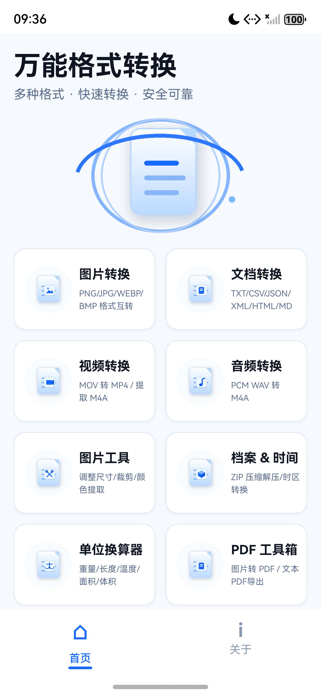
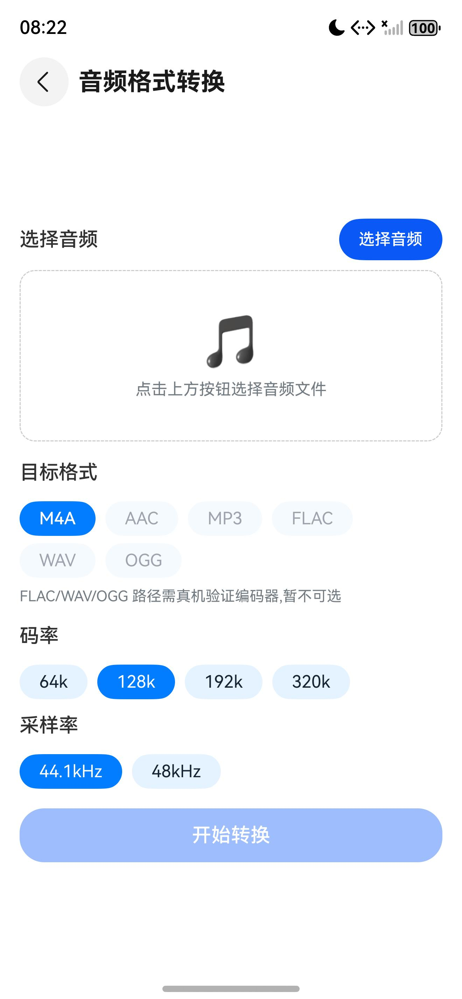
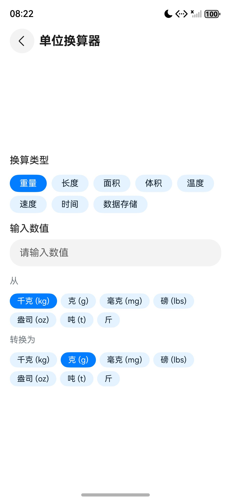
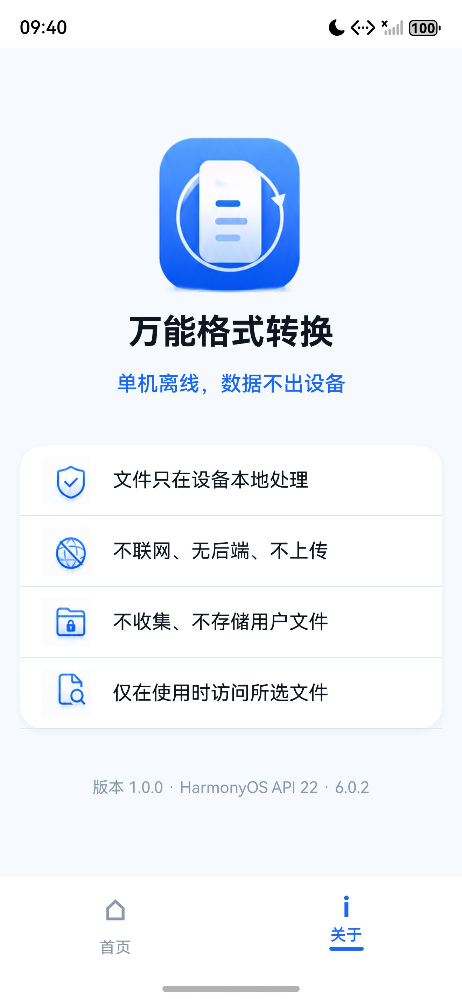

# 文件转换盒（FormatConverter）

HarmonyOS 原生本地文件格式转换工具：文档、图片、音频、视频与受限 PDF 转换，外加图片工具、档案与时间、单位换算共八个功能模块，全部在设备端完成；不申请网络权限、无后端、不上传文件，飞行模式与无网环境下可正常使用。

> 设计基线与能力矩阵见 [docs/开发文档.md](docs/开发文档.md)，界面与功能验收证据见 [docs/qa/](docs/qa/README.md)。

## 技术栈

- HarmonyOS API 22（系统 6.0.2），ArkTS 5.0 + ArkUI 声明式范式，Stage 模型（UIAbility）
- 设备类型：phone、tablet、2in1；按 320vp / 600vp / 840vp 断点切换 2 / 3 / 4 列布局，独立工具页固定 `NavigationMode.Stack`
- 系统能力：ImageKit、MediaKit、CoreFileKit、MediaLibraryKit，无网络依赖
- Native 扩展：C++17 + CMake 构建 `libnative_audio.so`（AudioCodec / AVMuxer / AVSource / AVDemuxer）
- 架构要点：`engines/` 转换引擎抽象层（`IConvertEngine` + `EngineRegistry`）隔离原生 Kit 与未来三方离线引擎；`common/converters/` 承载文档转换矩阵
- 无第三方运行时依赖，仅本地 OHPM 依赖（测试用 `@ohos/hypium`）；无用户文件持久化需求，中间产物写入应用沙箱
- 构建工具：Hvigor（`assembleHap`）

## 功能特性

**图片格式转换**

- PNG、JPG、JPEG、WEBP、BMP 互转，可设置输出质量
- 输出经系统授权保存到相册或指定目录
- HEIF、GIF 输出灰置为「功能正在开发」，不进入选择、转换与保存路径

**文档格式转换**

- TXT、LOG、CSV、JSON、XML、HTML、MD 七类文本格式互转，源编码可选 UTF-8 / GBK / UTF-16LE，输出统一 UTF-8
- 转换矩阵：TXT / LOG → TXT、MD、HTML；CSV → JSON、XML、MD、HTML、TXT；JSON → CSV、XML、MD、HTML、TXT；XML → JSON、CSV、TXT、MD、HTML；MD → HTML、TXT；HTML → TXT、MD
- 目标格式按全部已选源文件的共同可转换关系动态过滤；批量转换带进度展示、中途取消与同格式跳过计数
- 批量结果先生成在应用沙箱，再由一次系统保存对话框选择全部输出位置，取消保存时整批停止并清理临时结果

**图片工具**

- 图像调整：指定宽 / 高，可保持宽高比
- 裁剪图片：指定 X / Y 起点与裁剪宽高
- 颜色提取：从图片中央区域采样，输出主色调
- 三项操作基于 ImageKit PixelMap 离线完成

**音频转换**

- 16-bit PCM WAV 转 M4A（AAC LC），码率 64 / 128 / 192 / 320 kbps，采样率 44.1 / 48 kHz 或跟随源文件
- 转码走自研 Native 音频能力，不依赖第三方引擎
- MP3、FLAC、OGG、AAC 输出灰置

**视频转换**

- 视频转 MP4（API 22 下仅可靠支持 MP4 容器输出）
- 含 AAC 音轨的 MP4 无损重封装为 M4A：按时间戳交错复制音轨 sample，不启动编码器
- MOV 等 H.264/AAC 源按无损重封装路径处理，其他轨道编码明确拒绝
- MP3 音轨提取灰置

**档案与时间**

- 档案转换：ZIP 压缩（一次最多 20 个文件）与 ZIP 解压，选择器覆盖 31 类常用后缀；7Z / TAR.GZ / RAR 灰置
- 时区转换：CST、EST、PST、JST、GMT、CET、IST、KST、AEST 九个时区互转，跨日结果标注 ±1 天，非法分钟输入给出提示

**单位换算器**

- 重量：千克、克、毫克、磅、盎司、吨、斤
- 长度：米、千米、厘米、毫米、英尺、英寸、英里、码
- 面积：平方米、平方千米、公顷、英亩、平方英尺、亩
- 体积：升、毫升、加仑、夸脱、杯
- 温度、速度、时间、数据存储：单位表见 `pages/UnitConverterPage.ets`
- 输入即时联动换算，分类与单位切换后按当前值重算

**PDF 工具箱**

- 图片转 PDF：JPG / PNG / WEBP / BMP 合成 PDF，一次最多 9 张
- 文本转 PDF：TXT / MD 转为 PDF；HTML 转 PDF：提取 HTML 文本后生成
- 反向转换：项目自产未压缩文本 PDF 转 DOC（Word）或 Markdown，直接读取源文件字节
- 大文件保护：图片与 PDF 输入均设体积上限并给出明确提示

**已知限制**

- 视频输出仅可靠支持 MP4 容器，缺少视频编码器时其他容器不保证产出
- PDF 反向转换不支持压缩流、加密、对象流、扫描件与复杂嵌入字体 PDF
- 档案格式仅支持 ZIP；无跨设备协同与云同步能力

## 截图

> 以下为 `docs/qa/` 中已签入仓库的设备运行截图（2026-08-03 版界面，应用名称在后一次提交中由「万能格式转换」统一为「文件转换盒」）。

| 说明 | 截图 |
| --- | --- |
| 首页：八个功能入口与双标签底栏 |  |
| 图片格式转换 |  |
| 文档格式转换 |  |
| 视频转换 |  |
| 音频转换 |  |
| 档案与时间 |  |
| 单位换算器 |  |
| 关于页：离线与隐私声明 |  |

## 目录结构

```text
AppScope/                     应用级配置（bundleName、版本、图标）
entry/src/main/
  cpp/                        Native 音频能力（CMake + native_audio.cpp）
  ets/entryability/           UIAbility 入口
  ets/pages/                  Index、DocumentConvertPage、ImageConvertPage、AudioConvertPage、
                              VideoConvertPage、ImageToolsPage、ArchiveTimePage、
                              UnitConverterPage、PdfToolsPage、AboutPage
  ets/components/             页头、文件选择面板、格式胶囊、进度条、结果列表等共享组件
  ets/engines/                转换引擎抽象层（IConvertEngine、EngineRegistry、NativeTextEngine）
  ets/services/               转换、选择、保存与音轨重封装服务
  ets/common/                 常量、模型、工具与 converters/ 文档转换核心
  resources/                  字符串、颜色、媒体资源与路由配置
docs/                         开发文档、QA 证据、功能方案与设计规格
scripts/                      构建脚本、静态门禁与 Node 契约测试
design.md / AGENTS.md         产品设计、AI 代理规则
build-profile.json5           工程构建配置（6.0.2(22)）
oh-package.json5              工程依赖
```

## 构建与运行

1. 安装 DevEco Studio（需支持 API 22 的 SDK 6.0.2），并在 SDK Manager 中安装 HarmonyOS 6.0.2(22) SDK
2. 用 DevEco Studio 打开仓库根目录，等待 SDK 与 Hvigor 依赖同步完成
3. 在 DevEco Studio 中配置自动签名（本地运行），或写入自己的发布签名材料
4. 选择 `entry` 模块与目标设备（phone / tablet / 2in1）直接运行，或用脚本构建 HAP：

```powershell
# 静态门禁：标准文档、Stage 配置、目录职责与契约脚本
powershell -NoProfile -ExecutionPolicy Bypass -File .\scripts\check-standard.ps1

# 构建（脚本优先使用工程内 hvigorw，否则回退 DevEco Studio 自带的 Hvigor）
powershell -NoProfile -ExecutionPolicy Bypass -File .\scripts\build-harmony.ps1

# ArkTS 类型检查与单个契约脚本
node .\scripts\_type_check.js
node .\scripts\test-document-targets.js
```

构建产物位于 `entry/build/default/outputs/default/`。仓库内 `build-profile.json5` 只声明构建产品与 `buildModeSet`，不含签名材料。

## 隐私说明

- **不申请网络权限**：`entry/src/main/module.json5` 不声明 `requestPermissions`，工程内不含 `ohos.permission.INTERNET`，应用无法联网
- **文件本地处理**：所有转换、压缩与重封装均在设备端完成，无服务端、无云存储、无账号体系
- **临时授权**：读取文件依赖系统文件选择器（picker）的临时授权，产物由用户在系统保存对话框中指定位置
- **不收集数据**：不采集、不上传、不存储用户文件内容，应用沙箱内的中间产物在批次结束或取消后清理
- **无附加组件**：无广告、无统计 SDK、无三方网络库

## 许可

本项目采用 [Apache License 2.0](LICENSE) 许可。